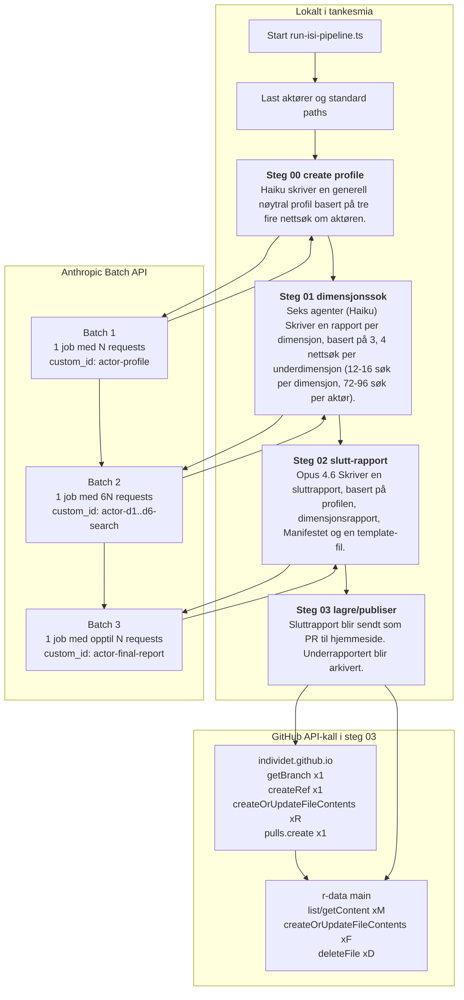

<<<<<<< HEAD
## ISI-pipeline: faktisk kjøring og dataflyt

Denne mappen inneholder en 4-stegs pipeline som kjøres fra:

- `pipelines/isi-rangering/run-isi-pipeline.ts`

Standard input/output ved full kjøring:

- Input aktører: `pipelines/isi-rangering/actors.json`
- Manifest (kondensert): `manifest-kondensert.md`
- ISI-rammeverk: `skills/isi-scoring/references/ISI.md`
- Rapportmal: `skills/isi-scoring/references/template.md`
- Lokalt output: `output/isi-rangering/`

Kjøring (fra `tankesmia/`):

```bash
npx tsx pipelines/isi-rangering/run-isi-pipeline.ts
```

Dry-run (skriver request-filer, men kjører ikke batchene):

```bash
npx tsx pipelines/isi-rangering/run-isi-pipeline.ts --dry-run
```

Hvis du sender til GitHub i steg 4 (ikke dry-run), må `GITHUB_TOKEN` være satt.

## Flytdiagram: kjøring fra A til Å



Forklaring på volumer i grafen:

- `N` = antall aktører i `actors.json`.
- `R` = antall rapporter som faktisk finnes (`rapport.md`) og publiseres.
- `F` = antall rådatafiler som finnes lokalt under `output/isi-rangering/<actor>/`.
- `D` = antall fjernfiler i `r-data` som slettes fordi de ikke finnes lokalt.
- `M` = antall API-oppslag som trengs for å traversere fjernmappe(r) i `r-data`.

## Steg for steg

## 00_create_profile

Hva skjer:

- Leser alle aktører fra `actors.json`.
- Lager 1 batch request per aktør (`<actor-slug>-profile`) med web-søk-verktøy.
- Parser svaret via `tolkMarkdownFil` (importert fra steg 01).
- Skriver profil til: `output/isi-rangering/<actor-slug>/profil.md`.

Dry-run:

- Skriver: `output/isi-rangering/00_requests_dry_run.json`.

## 01_search_pipeline

Hva skjer:

- Leser aktører + manifest.
- Laster `profil.md` for hver aktør fra output-mappen (fra steg 00).
- Lager 6 requests per aktør (D1-D6), totalt `antall aktører * 6`.
- Skriver dimensjonsfiler:
  - `output/isi-rangering/<actor-slug>/d1-search.md`
  - `output/isi-rangering/<actor-slug>/d2-search.md`
  - `output/isi-rangering/<actor-slug>/d3-search.md`
  - `output/isi-rangering/<actor-slug>/d4-search.md`
  - `output/isi-rangering/<actor-slug>/d5-search.md`
  - `output/isi-rangering/<actor-slug>/d6-search.md`

Dry-run:

- Skriver: `output/isi-rangering/01_requests_dry_run.json`.

## 02_end_report

Hva skjer:

- Leser aktører, mal, manifest og ISI-rammeverk.
- For hver aktør sjekkes at disse finnes før request bygges:
  - `profil.md`
  - `d1-search.md` ... `d6-search.md`
- Samler disse 7 filene til ett researchgrunnlag.
- Lager 1 final-report request per aktør (`<actor-slug>-final-report`).
- Skriver sluttresultat til: `output/isi-rangering/<actor-slug>/rapport.md`.

Dry-run:

- Skriver: `output/isi-rangering/02_requests_dry_run.json` (hvis det finnes requests).

## 03_save_reports

Hva skjer:

- Leser aktører og mapper dem til slugs.
- Publiserer rapporter (`rapport.md`) til PR-branch i `Individet/individet.github.io`:
  - `content/isi/<actor-slug>.md`
- Synker hele lokale aktørmapper til `Individet/r-data` på `main`:
  - `isi-rangering/<actor-slug>/*`
- Sletter fjernfiler i `r-data` som ikke lenger finnes lokalt for samme aktør.

Dry-run:

- Logger hva som ville blitt oppdatert/slettet/opprettet, uten å skrive til GitHub.

## Data som gjenbrukes mellom steg

- `profil.md` produseres i steg 00 og brukes i steg 01, 02 og 03.
- `d1..d6-search.md` produseres i steg 01 og brukes i steg 02 og 03.
- `rapport.md` produseres i steg 02 og brukes i steg 03.
- `actors.json` brukes i alle steg for å holde samme aktørsett gjennom hele pipeline-kjøringen.
=======
Denne pipelinen går gjennom følgende faser:

## 00 Lager en aktørprofil per angitt aktør

Generelle haiku-søk lager en profil per aktør. Denne blir lagret som en markdown-fil, og comittet til repoet med rådata:

git@github.com:Individet/r-data.git

i plasseringen isi-rangering/[actor-slug]/profil.md

## 01 Lager en søkerapport per dimensjon

Denne aktør-profilen blir også tatt med videre, hvor hver angitt aktør blir analysert i ISI-rangeringens seks dimensjoner, av haiku søke-agenter.

Disse rapportene blir også lagret som hver sin markdown-fil, i samme repo som den nevnt over:

git@github.com:Individet/r-data.git

i plasseringene

- isi-rangering/[actor-slug]/d1-search.md
- isi-rangering/[actor-slug]/d2-search.md
- isi-rangering/[actor-slug]/d3-search.md
- isi-rangering/[actor-slug]/d4-search.md
- isi-rangering/[actor-slug]/d5-search.md
- isi-rangering/[actor-slug]/d6-search.md

## 02 Lager en fullstendig rapport

Til slutt blir en fullstendig rapport lagd om hver aktør, basert på de syv foregående markdown-filene. Denne blir skrevet av Opus, og følger malen man finner i `skills\isi-scoring\references\template.md`. Deretter blir resultatet sendt som en PR mot hjemmesiden på repoet https://github.com/Individet/individet.github.io med plassering `content/isi/reports/[actor-slug].md`
>>>>>>> b9ea85f... WIP
